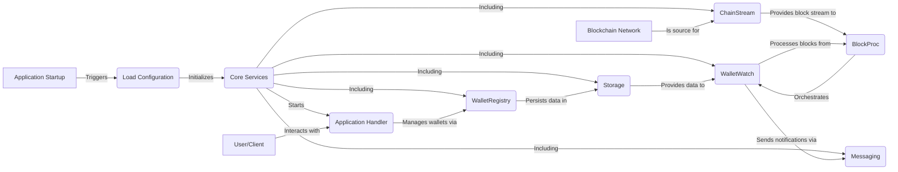
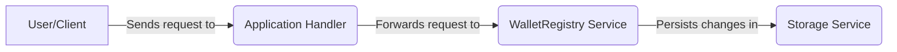
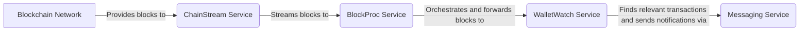

# BlockWatch

BlockWatch is a highly extensible and resilient blockchain data indexer. It provides a solid foundation for developers to build custom data pipelines that react to blockchain events in real-time. By leveraging a modular architecture, BlockWatch allows for easy integration with different blockchains, messaging systems, and storage backends.

## Goal

The primary goal of BlockWatch is to provide a reliable and scalable platform for monitoring and processing blockchain data. It is designed to be a flexible and extensible tool that can be adapted to a wide range of use cases, from simple transaction monitoring to complex data analysis.

## How it Works

BlockWatch is composed of a set of services that work together to provide a complete data processing pipeline. The core components are:

*   **ChainStream**: This service connects to multiple blockchain networks, fetches blocks, and streams them to other services. It is designed to be resilient and can handle network failures and retries.

*   **WalletWatch**: This service processes blocks from the Chainstream service, filters them to find transactions involving watched wallets, and sends notifications. It includes an optimized algorithm for filtering transactions and an idempotency guard to prevent duplicate processing.

*   **WalletRegistry**: This service provides a simple API for managing the list of watched wallets. It is responsible for persisting the list of wallets in a storage backend.

*   **BlockProc**: This service orchestrates the block processing pipeline, connecting the Chainstream and Wallet Watch services and managing the overall workflow.

## Modularity

The project is designed with modularity in mind, allowing developers to easily extend its functionality. The key areas of extension are:

*   **Blockchain**: The `internal/infra/blockchain` package contains the implementation of the blockchain clients. To add support for a new blockchain, you need to implement the `Blockchain` interface and register it in the `internal/chainstream` package.

*   **Messaging**: The `internal/infra/messaging` package contains the implementation of the messaging clients. To add support for a new messaging system, you need to implement the `Messaging` interface and register it in the `internal/bootstrap/messaging` package. The project currently supports RabbitMQ and Redis.

*   **Storage**: The `internal/infra/storage` package contains the implementation of the storage clients. To add support for a new storage backend, you need to implement the `Storage` interface and register it in the `internal/bootstrap/storage` package. The project currently supports PostgreSQL and Redis.

## Requirements

*   Go 1.24 or higher
*   Docker and Docker Compose
*   A running PostgreSQL or Redis instance
*   A running RabbitMQ or Redis instance
*   Connection to a blockchain node (e.g., Ethereum, Solana)

## Getting Started

1.  **Clone the repository:**

    ```bash
    git clone git@github.com:gabapcia/blockwatch.git
    cd blockwatch
    ```

2.  **Set up the environment:**

    Copy the `.env.example` file to `.env` and fill in the required environment variables.

    ```bash
    cp .env.example .env
    ```

3.  **Run the services:**

    The `docker-compose.yml` file contains the service definitions for the database and messaging systems. To start them, run:

    ```bash
    docker-compose up -d
    ```

4.  **Run the application:**

    The application is currently a command-line interface (CLI), but it is designed to be extensible. You can create new handlers to expose the functionality as a REST API, gRPC service, or any other interface you need.

    To see the available commands, run:
    
    ```bash
    go run cmd/cli/main.go --help
    ```

## Configuration

The application is configured using environment variables. The `.env.example` file contains a list of all the available options. The configuration is loaded and validated at startup.

## Dev Cycle

The development cycle is based on a simple workflow:

1.  **Create a feature branch:**

    ```bash
    git checkout -b feature/my-new-feature
    ```

2.  **Write code and tests:**

    The project has a comprehensive test suite that covers all the core functionality. To run the tests, use the following command:

    ```bash
    make unit-tests
    ```

3.  **Open a pull request:**

    Once the feature is complete, open a pull request against the `main` branch. The pull request will be reviewed and merged by the maintainers.

## Maintainability

The project is designed to be easy to maintain. The codebase is organized into small, focused packages with clear responsibilities. The use of dependency injection and interfaces makes it easy to test and refactor the code. The project also uses `sqlc` to generate type-safe Go code from SQL queries, which improves code quality and security.

## Next Steps

*   Add support for more blockchains (e.g., Bitcoin, Polygon)
*   Add a web interface for managing the wallet registry
*   Improve the observability of the services

## Extending the Project

This section explains how to extend the project with new database and messaging adapters.

### Creating a New Database Adapter

To create a new database adapter, you need to:

1.  Define a new connection struct in the `internal/pkg/config/storage` package.
2.  Create a new package in `internal/infra/storage` and implement the `storage.Client` interface from `internal/bootstrap/storage/storage.go`.
3.  Add a new entry to the `storageFactories` map in `internal/bootstrap/storage/resolver.go` with the appropriate conversion and instantiation logic.

### Creating a New Messaging Adapter

To create a new messaging adapter, you need to:

1.  Define a new connection and publisher struct in the `internal/pkg/config/messaging` package.
2.  Create a new package in `internal/infra/messaging` and implement the `messaging.Client` interface from `internal/bootstrap/messaging/messaging.go`.
3.  Add a new entry to the `messagingFactories` map in `internal/bootstrap/messaging/resolver.go` with the appropriate `BuildConnection` and `InterfaceAdapters`.

### Adding a New Handler Type

To add a new handler type (e.g., a REST API or gRPC service), you need to:

1.  Create a new package in the `internal/handlers` directory and implement your handler logic.
2.  Create a new file in the `internal/bootstrap` package with the name of your handler (e.g., `rest.go`).
3.  In the new file, create a function with the same name as the handler (e.g., `REST`) that takes the required services as arguments and starts the handler.
4.  Create a new folder inside the `cmd` directory with the name of your handler (e.g., `rest`).
5.  In the new folder, create a `main.go` file that is almost identical to the `cmd/cli/main.go` file, but instead of calling the `CLI` method, it should call the new handler's method on the `bootstrap` struct.

## Package Docs

The project is organized into the following packages:

*   `cmd`: Contains the entry point of the application.
*   `internal/bootstrap`: Contains the application's bootstrap logic.
*   `internal/blockproc`: Contains the core logic for processing blocks.
*   `internal/chainstream`: Contains the logic for streaming blocks from a blockchain.
*   `internal/walletregistry`: Contains the logic for managing the wallet registry.
*   `internal/walletwatch`: Contains the logic for watching wallets.
*   `internal/handlers`: Contains the implementation of the command-line handlers.
*   `internal/infra`: Contains the implementation of the infrastructure clients (blockchain, messaging, storage).

## System Lifecycle

The following diagrams provide a high-level overview of the system's lifecycle and data flow.

### System Lifecycle

This diagram illustrates the overall lifecycle of the application, from startup to handler execution.



### Register/Unregister Wallet

This diagram illustrates the process of registering or unregistering a wallet for monitoring.



### Block Stream

This diagram illustrates the flow of block data through the system.



## Makefile Commands

The `Makefile` provides a set of useful commands for building, running, and testing the application. To see a list of all available commands and their descriptions, run:

```bash
make help
```
