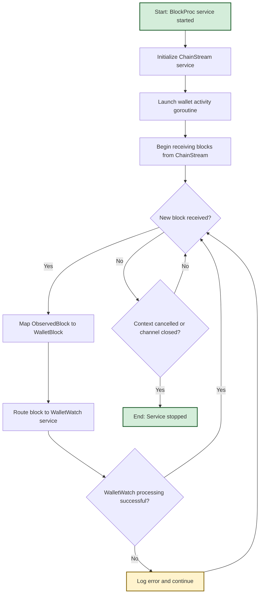

# BlockProc Package

The `blockproc` package provides a service for coordinating the block-level processing pipeline, combining multiple downstream workflows (e.g., wallet activity monitoring) into a unified orchestration layer. It serves as the central coordinator that wires together blockchain data streaming and various processing workflows within the `blockwatch` project.

## Package Overview

BlockProc acts as the main orchestrator that connects the `chainstream` service (which provides blockchain blocks) with downstream processing services like `walletwatch` (which monitors wallet activity). It manages the lifecycle of the entire block processing pipeline, ensuring that observed blocks are properly routed through all configured workflows.

## Architecture

### Core Components

```
┌─────────────────────────────────────────────────────────────┐
│                    BlockProc Service                        │
├─────────────────────────────────────────────────────────────┤
│  ┌─────────────────┐  ┌─────────────────┐  ┌──────────────┐ │
│  │   ChainStream   │  │   WalletWatch   │  │   Lifecycle  │ │
│  │    Service      │  │    Service      │  │  Management  │ │
│  └─────────────────┘  └─────────────────┘  └──────────────┘ │
├─────────────────────────────────────────────────────────────┤
│                    Block Orchestration                      │
│  ┌─────────────────┐  ┌─────────────────┐  ┌──────────────┐ │
│  │  Block Stream   │  │   Data Mapping  │  │   Workflow   │ │
│  │   Management    │  │   & Routing     │  │ Coordination │ │
│  └─────────────────┘  └─────────────────┘  └──────────────┘ │
└─────────────────────────────────────────────────────────────┘
```

## Key Interfaces

### Service Interface
```go
type Service interface {
    // Start begins the block processing pipeline by launching chainstream
    // and wiring all downstream workflows (e.g., wallet activity handling).
    //
    // Returns ErrServiceAlreadyStarted if Start is called more than once.
    // Call Close to shut down all background routines.
    Start(ctx context.Context) error

    // Close shuts down the blockproc service and cancels all active routines.
    // It is safe to call Close even if the service was never started.
    Close()
}
```

### Dependencies
The service depends on implementations of the following interfaces:

#### ChainStream Service
Provides the stream of blockchain blocks to be processed.

```go
type chainstream.Service interface {
    Start(ctx context.Context) (<-chan ObservedBlock, error)
    Close()
}
```

#### WalletWatch Service
Handles wallet-related processing for each block.

```go
type walletwatch.Service interface {
    NotifyWatchedTransactions(ctx context.Context, block Block) error
}
```

## Data Flow

### Block Processing Pipeline

1. **Block Streaming**: ChainStream service provides observed blocks through a channel
2. **Data Mapping**: Observed blocks are converted to wallet-compatible format
3. **Workflow Routing**: Blocks are routed to appropriate processing workflows
4. **Wallet Processing**: WalletWatch service processes blocks for wallet activity

### Data Mapping

The service includes a mapping function that converts `chainstream.ObservedBlock` to `walletwatch.Block`:

```go
func mapObservedToWalletBlock(b chainstream.ObservedBlock) walletwatch.Block
```

This mapping ensures cross-module compatibility while preserving clear separation of concerns.

## How It Works

### 1. Initialization
The service is created with implementations for both chainstream and walletwatch services.

```go
service := blockproc.New(chainstreamService, walletwatchService)
```

### 2. Service Lifecycle

1. **Start**: The `Start` method initializes the processing pipeline
   - Starts the chainstream service to begin receiving blocks
   - Launches a goroutine to handle wallet activity processing
   - Sets up context cancellation for graceful shutdown
2. **Processing**: Blocks are continuously processed in the background
   - Receives blocks from chainstream channel
   - Maps blocks to wallet-compatible format
   - Routes blocks to walletwatch service
3. **Shutdown**: The `Close` method stops all processing
   - Cancels the processing context
   - Closes the chainstream service
   - Stops all background goroutines

### 3. Workflow Diagram



## Usage

### Basic Usage

```go
// Assume you have implementations for ChainStream and WalletWatch services
var chainstreamService chainstream.Service
var walletwatchService walletwatch.Service

// Create a new blockproc service
service := blockproc.New(chainstreamService, walletwatchService)

// Start the block processing pipeline
ctx := context.Background()
err := service.Start(ctx)
if err != nil {
    log.Fatalf("Failed to start blockproc service: %v", err)
}

// The service will now continuously process blocks in the background
// until Close() is called or the context is cancelled

// Shutdown the service when done
defer service.Close()
```

### Error Handling

The service handles various error conditions gracefully:

- **ChainStream Start Failure**: If the chainstream service fails to start, the error is propagated
- **WalletWatch Processing Errors**: Errors from walletwatch processing are logged but don't stop the pipeline
- **Context Cancellation**: The service responds to context cancellation for graceful shutdown
- **Multiple Start Calls**: Returns `ErrServiceAlreadyStarted` if Start is called more than once

### Lifecycle Management

```go
service := blockproc.New(chainstreamService, walletwatchService)

// Start the service
ctx, cancel := context.WithCancel(context.Background())
err := service.Start(ctx)
if err != nil {
    if errors.Is(err, blockproc.ErrServiceAlreadyStarted) {
        log.Println("Service already started")
    } else {
        log.Fatalf("Failed to start service: %v", err)
    }
}

// Service runs in background...

// Graceful shutdown
cancel() // Cancel context to signal shutdown
service.Close() // Ensure all resources are cleaned up
```

## Integration

The `blockproc` package is designed to be the main entry point for block processing in the `blockwatch` project. It integrates with:

### ChainStream Integration
```go
// Setup chainstream with multiple networks
networks := []chainstream.NetworkConfig{
    {Name: "ethereum", RPC: "https://eth-rpc.example.com"},
    {Name: "polygon", RPC: "https://polygon-rpc.example.com"},
}
chainstreamService := chainstream.New(networks)
```

### WalletWatch Integration
```go
// Setup walletwatch with storage and notifier
walletwatchService := walletwatch.New(
    walletStorage,
    transactionNotifier,
    walletwatch.WithIdempotencyGuard(idempotencyGuard),
)
```

### Complete Integration Example
```go
// Complete setup of the block processing pipeline
func setupBlockProcessing() blockproc.Service {
    // Setup dependencies
    chainstreamService := chainstream.New(networks)
    walletwatchService := walletwatch.New(walletStorage, transactionNotifier)
    
    // Create and return the orchestrator
    return blockproc.New(chainstreamService, walletwatchService)
}

func main() {
    service := setupBlockProcessing()
    
    ctx, cancel := context.WithCancel(context.Background())
    defer cancel()
    
    // Start the entire pipeline
    if err := service.Start(ctx); err != nil {
        log.Fatalf("Failed to start block processing: %v", err)
    }
    defer service.Close()
    
    // Handle shutdown signals
    sigCh := make(chan os.Signal, 1)
    signal.Notify(sigCh, os.Interrupt, syscall.SIGTERM)
    <-sigCh
    
    log.Println("Shutting down block processing...")
}
```

## Thread Safety

The service is designed to be thread-safe:

- **Mutex Protection**: Internal state is protected by a mutex to handle concurrent Start/Close calls
- **Single Start**: Ensures the service can only be started once per lifecycle
- **Safe Shutdown**: Close can be called multiple times safely
- **Goroutine Management**: Properly manages background goroutines with context cancellation

## Future Extensibility

The service is designed to easily accommodate additional processing workflows:

- **New Workflows**: Additional processing services can be added alongside walletwatch
- **Parallel Processing**: Multiple workflows can process the same blocks concurrently
- **Conditional Routing**: Blocks can be routed to different workflows based on criteria
- **Metrics & Monitoring**: Processing metrics and health checks can be added

Example of extending with additional workflows:

```go
// Future extension example
func (s *service) startAdditionalWorkflows(ctx context.Context, blocksCh <-chan chainstream.ObservedBlock) {
    go s.handleWalletActivity(ctx, blocksCh)
    go s.handleAnalytics(ctx, blocksCh)      // Future: analytics workflow
    go s.handleAlerts(ctx, blocksCh)         // Future: alerting workflow
    go s.handleMetrics(ctx, blocksCh)        // Future: metrics collection
}
