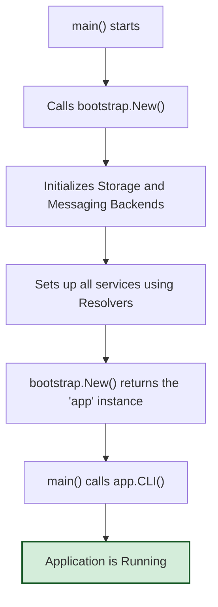

# Bootstrap

The `bootstrap` package is responsible for initializing and wiring together the core components of the `blockwatch` application. It provides a centralized mechanism for setting up dependencies, such as messaging and storage, based on the application's configuration. This package ensures that all services are properly configured and connected, ready to be consumed by different application handlers like a CLI, REST API, or gRPC server.

## Package Overview

The bootstrap package acts as the application's entry point for initialization. It reads configuration settings and uses them to instantiate and connect various infrastructure components, such as messaging queues (RabbitMQ, Redis) and data stores (PostgreSQL, Redis). It abstracts the complexity of setting up these components, allowing different handlers to run with a consistent, fully initialized environment.

## Architecture

### Core Components

```
┌─────────────────────────────────────────────────────────────┐
│                    Bootstrap Service                        │
├─────────────────────────────────────────────────────────────┤
│  ┌─────────────────┐  ┌─────────────────┐  ┌──────────────┐ │
│  │    Messaging    │  │     Storage     │  │ Configuration│ │
│  │   Resolver      │  │    Resolver     │  │   Loading    │ │
│  └─────────────────┘  └─────────────────┘  └──────────────┘ │
├─────────────────────────────────────────────────────────────┤
│                 Component Initialization                    │
│  ┌─────────────────┐  ┌─────────────────┐  ┌──────────────┐ │
│  │ RabbitMQ/Redis  │  │ PostgreSQL/Redis│  │     CLI      │ │
│  │   Messaging     │  │     Storage     │  │   Setup      │ │
│  └─────────────────┘  └─────────────────┘  └──────────────┘ │
└─────────────────────────────────────────────────────────────┘
```

## Key Functions

### Application Initialization
The `New` function is the primary entry point for bootstrapping the application. It sets up the entire application stack and returns a struct containing all the wired services. This bootstrapped instance can then be used to run any handler, such as a CLI, REST API, or gRPC server.

```go
func New(ctx context.Context, config config.Config) (*bootstrap, error)
```

## How It Works

### 1. Initialization
The `New` function orchestrates the entire setup process:

1.  **Backend Initialization**: It calls `storage.Init` and `messaging.Init` to create connections for all configured backends (e.g., PostgreSQL, Redis, RabbitMQ).
2.  **Service Wiring**: It constructs each core service (`ChainStream`, `WalletWatch`, etc.) one by one.
3.  **Dependency Resolution**: Inside each service's setup function, `storage.Resolve` and `messaging.Resolve` are used to pick the correct backend instance for each required interface, based on the configuration.
4.  **Return Instance**: It returns a fully wired `bootstrap` struct containing all the services, ready for use.

### 2. Dependency Resolution
The package uses resolvers to decouple the application from specific infrastructure implementations.

-   **Messaging Resolver**: Determines which messaging client to use based on configuration (`messaging.NewResolver`).
-   **Storage Resolver**: Determines which storage client to use based on configuration (`storage.NewResolver`).

### 3. Workflow Diagram



## Usage

### Basic Usage
The `bootstrap` package is used in `main.go` to initialize the application. The caller then decides which handler to run.

```go
func main() {
    ctx := context.Background()

    // 1. Load application configuration
    cfg, err := config.Load()
    if err != nil {
        log.Fatalf("Failed to load config: %v", err)
    }

    // 2. Bootstrap the application to get all wired services
    app, err := bootstrap.New(ctx, cfg)
    if err != nil {
        log.Fatalf("Failed to bootstrap application: %v", err)
    }
    defer app.Close()

    // 3. Choose a handler to run.
    // The bootstrapped 'app' instance provides handler methods.
    if err := app.CLI(ctx); err != nil {
        log.Fatalf("CLI handler exited with error: %v", err)
    }
}
```

## Integration

The `bootstrap` package uses its `storage` and `messaging` sub-packages to handle dependency resolution.

### Backend Initialization
First, `bootstrap.New` calls `storage.Init` and `messaging.Init` to create all configured backend clients.

```go
// In bootstrap.New()
if err := storage.Init(ctx, config.Engines.Storage); err != nil {
    return nil, err
}
if err := messaging.Init(ctx, config.Engines.Messaging); err != nil {
    return nil, err
}
```

### Dependency Resolution
Then, when setting up a specific service, it uses the `Resolve` function to get the correct backend implementation for a given interface. The `config.WalletWatch.WalletStorage` struct acts as a "picker" that tells the resolver which initialized backend to return.

```go
// In setupWalletWatch()
walletStorage, err := storage.Resolve[walletwatch.WalletStorage](ctx, config.WalletWatch.WalletStorage)
if err != nil {
    return nil, err
}

transactionNotifier, err := messaging.Resolve[walletwatch.TransactionNotifier](ctx, config.WalletWatch.TransactionNotifier)
if err != nil {
    return nil, err
}
```
This pattern decouples services from concrete infrastructure implementations, allowing for flexible configuration.

## Extensibility

The bootstrap process is designed to be extensible. To add a new handler or service:

1.  **Add a New Handler**: Create a new method on the `bootstrap` struct (e.g., `API(ctx context.Context) error`) that runs the new handler, passing it the required services from the `bootstrap` instance.
2.  **Add a New Service**: If a new service is needed, create a `setup...` function for it, add the service to the `bootstrap` struct, and initialize it within the `New` function.
3.  **Update `main.go`**: Modify the entry point to select and run the desired handler (e.g., `app.API(ctx)`).

This approach keeps the initialization logic centralized and decouples it from the specific way the application is run.
