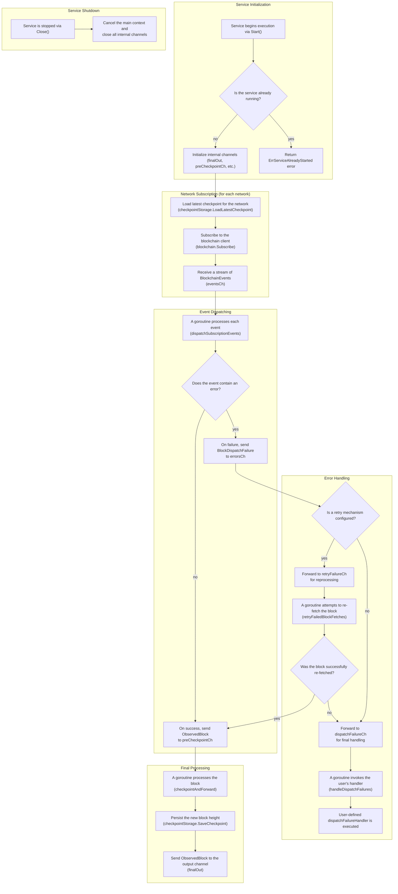

# ChainStream Package

The `chainstream` package provides a robust, multi-blockchain block streaming service with built-in resilience features. It serves as the core monitoring component within the blockwatch project, designed to observe multiple blockchain networks simultaneously and handle failures gracefully.

## Package Overview

ChainStream is a streaming service that subscribes to blockchain networks and emits observed blocks through a unified interface. It abstracts away the complexities of network failures, retry logic, and checkpoint management, providing a clean stream of blockchain events to consumers.

## Architecture

### Core Components

```
┌─────────────────────────────────────────────────────────────┐
│                    ChainStream Service                      │
├─────────────────────────────────────────────────────────────┤
│  ┌─────────────────┐  ┌─────────────────┐  ┌──────────────┐ │
│  │   Blockchain    │  │   Checkpoint    │  │    Retry     │ │
│  │   Interface     │  │   Storage       │  │   Handler    │ │
│  └─────────────────┘  └─────────────────┘  └──────────────┘ │
├─────────────────────────────────────────────────────────────┤
│                    Event Processing                         │
│  ┌─────────────────┐  ┌─────────────────┐  ┌──────────────┐ │
│  │  Subscription   │  │   Dispatch      │  │   Failure    │ │
│  │   Manager       │  │   Handler       │  │   Handler    │ │
│  └─────────────────┘  └─────────────────┘  └──────────────┘ │
├─────────────────────────────────────────────────────────────┤
│                     Output Stream                           │
│              ┌─────────────────────────────┐                │
│              │      ObservedBlock          │                │
│              │       Channel               │                │
│              └─────────────────────────────┘                │
└─────────────────────────────────────────────────────────────┘
```

## Key Interfaces

### Service Interface
```go
type Service interface {
    // Start begins the block observation process and returns a channel of observed blocks
    Start(ctx context.Context) (<-chan ObservedBlock, error)
    
    // Close terminates all background processes and cleans up resources
    Close()
}
```

### Blockchain Interface
The package depends on implementations of the `Blockchain` interface to provide blockchain data:

```go
type Blockchain interface {
    // FetchBlockByHeight retrieves a specific block by its height
    FetchBlockByHeight(ctx context.Context, height types.Hex) (Block, error)
    
    // Subscribe streams blocks starting from the specified height
    Subscribe(ctx context.Context, fromHeight types.Hex) (<-chan BlockchainEvent, error)
}
```

### CheckpointStorage Interface
Optional interface for persisting processing progress:

```go
type CheckpointStorage interface {
    // SaveCheckpoint records the latest processed block height for a network
    SaveCheckpoint(ctx context.Context, network string, height types.Hex) error
    
    // LoadLatestCheckpoint retrieves the last saved checkpoint for a network
    LoadLatestCheckpoint(ctx context.Context, network string) (types.Hex, error)
}
```

## Data Types

### ObservedBlock
The primary output type containing a blockchain block with network context:

```go
type ObservedBlock struct {
    Network string // Network identifier (e.g., "ethereum", "polygon")
    Block          // Embedded block data
}
```

### Block
Represents a blockchain block:

```go
type Block struct {
    Height       types.Hex     // Block height as hex string
    Hash         string        // Unique block hash
    Transactions []Transaction // List of transactions in the block
}
```

### BlockchainEvent
Events emitted by blockchain implementations:

```go
type BlockchainEvent struct {
    Height types.Hex // Block height (always present)
    Block  Block     // Block data (empty if Err is set)
    Err    error     // Error if block retrieval failed
}
```

## How It Works

### 1. Initialization
The service is created by calling `New`:
```go
service := chainstream.New(networks, options...)
```

### 2. Block Streaming Process

1. **Checkpoint Recovery**: For each network, load the last processed block height
2. **Subscription Setup**: Start streaming from the next block after the checkpoint
3. **Event Processing**: Handle incoming blockchain events:
   - **Success**: Convert to `ObservedBlock` and send for checkpointing
   - **Failure**: Send to retry system (if configured) or failure handler
4. **Retry Logic**: Attempt to recover failed block fetches
5. **Checkpointing**: Save progress for successful blocks
6. **Output Delivery**: Emit the `ObservedBlock` to the output channel


### 3. Output Stream
The service provides a unified stream of `ObservedBlock` data from all monitored networks.

### 5. Workflow Diagram

Below is a detailed Mermaid diagram illustrating the workflow of the chainstream package, focusing on the process of subscribing to blockchain networks, processing blocks, handling errors, and delivering data to consumers.



This diagram provides a detailed overview of the chainstream package workflow:
- **Service Initialization**: The service is started, checks if it's already running, and initializes the necessary channels.
- **Network Subscription**: For each network, it loads the last checkpoint and subscribes to the blockchain to receive a channel of events.
- **Event Dispatching**: Events are dispatched based on whether they contain an error. Successful events go to the processing channel, while errors are routed for handling.
- **Error Handling**: Errors are routed through an optional retry mechanism. If retries fail or are disabled, the error is passed to a user-defined failure handler.
- **Final Processing**: Successfully fetched blocks are checkpointed and sent to the final output channel.
- **Service Shutdown**: The `Close()` method gracefully shuts down all background processes and closes channels.

## Usage

### Basic Usage

```go
// Assume you have blockchain implementations
networks := map[string]chainstream.Blockchain{
    "ethereum": ethereumClient,
    "polygon":  polygonClient,
}

// Create service (returns ObservedBlock)
service := chainstream.New(networks)

// Start monitoring
ctx := context.Background()
blocksCh, err := service.Start(ctx)
if err != nil {
    return err
}
defer service.Close()

// Process blocks
for block := range blocksCh {
    fmt.Printf("Block from %s: height=%s, txs=%d\n", 
        block.Network, block.Height, len(block.Transactions))
}
```


### Advanced Configuration

```go
// Standard service with advanced options
service := chainstream.New(networks,
    // Configure retry strategy
    chainstream.WithRetry(retryStrategy),
    
    // Enable checkpoint persistence
    chainstream.WithCheckpointStorage(storage),
    
    // Custom failure handler
    chainstream.WithDispatchFailureHandler(func(ctx context.Context, failure chainstream.BlockDispatchFailure) {
        log.Printf("Persistent failure: network=%s height=%s errors=%v", 
            failure.Network, failure.Height, failure.Errors)
    }),
)

```

## Configuration Options

### WithRetry
Configure retry logic for transient failures:
```go
chainstream.WithRetry(retryStrategy)
```

### WithCheckpointStorage
Enable checkpoint persistence to resume from last processed block:
```go
chainstream.WithCheckpointStorage(storage)
```

### WithDispatchFailureHandler
Set custom handler for unrecoverable failures:
```go
chainstream.WithDispatchFailureHandler(handler)
```

## Error Handling

### BlockDispatchFailure
Represents failures in block processing:

```go
type BlockDispatchFailure struct {
    Network string    // Network where failure occurred
    Height  types.Hex // Block height that failed
    Errors  []error   // All errors encountered (including retries)
}
```

### Error Flow
1. **Transient Errors**: Sent to retry system (if configured)
2. **Persistent Errors**: Sent to dispatch failure handler
3. **Critical Errors**: Service startup failures returned immediately

## Features


### Resilience
- **Retry Logic**: Configurable retry strategies for transient failures
- **Error Isolation**: Network failures don't affect other networks
- **Graceful Degradation**: Continue processing other networks on partial failures

### Scalability
- **Concurrent Processing**: Each network runs independently
- **Buffered Channels**: Configurable buffer sizes for optimal throughput
- **Resource Management**: Proper cleanup and resource management
- **Asynchronous Transformation**: Non-blocking data transformation pipeline

### Reliability
- **Checkpoint System**: Resume from last processed block after restarts
- **No Data Loss**: Failed blocks are tracked and retried
- **Context Cancellation**: Proper cancellation handling throughout

## Thread Safety

The service is designed to be thread-safe:
- **Single Start**: Service can only be started once
- **Concurrent Access**: Safe to call `Close()` from any goroutine
- **Channel Safety**: All internal channels are properly synchronized

## Dependencies

The package has minimal external dependencies:
- **Blockchain Implementations**: Must implement the `Blockchain` interface
- **Retry Strategy**: Optional, must implement `retry.Retry` interface
- **Checkpoint Storage**: Optional, must implement `CheckpointStorage` interface
- **Context**: Standard Go context for cancellation and timeouts

## Integration

This package is designed to be used within the larger blockwatch project as the core blockchain monitoring component. It provides a clean abstraction over multiple blockchain networks while handling the complexities of network failures and state management.

The package expects blockchain implementations to be provided by other components in the project (e.g., `internal/infra/blockchain/ethereum`) and can optionally integrate with storage backends for checkpoint persistence.
