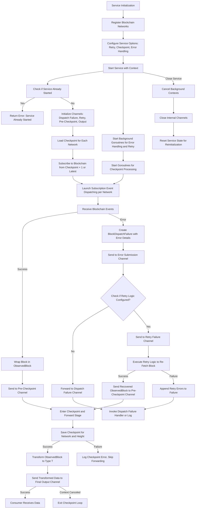

# ChainStream Package

The `chainstream` package provides a robust, multi-blockchain block streaming service with built-in resilience features and flexible data transformation capabilities. It serves as the core monitoring component within the blockwatch project, designed to observe multiple blockchain networks simultaneously while handling failures gracefully and transforming block data into custom formats.

## Package Overview

ChainStream is a streaming service that subscribes to blockchain networks and emits observed blocks or transformed data through a unified interface. It abstracts away the complexities of network failures, retry logic, checkpoint management, and data transformation, providing a clean stream of blockchain events or custom data structures to consumers.

## Architecture

### Core Components

```
┌─────────────────────────────────────────────────────────────┐
│                    ChainStream Service                      │
├─────────────────────────────────────────────────────────────┤
│  ┌─────────────────┐  ┌─────────────────┐  ┌──────────────┐ │
│  │   Blockchain    │  │   Checkpoint    │  │    Retry     │ │
│  │   Interface     │  │   Storage       │  │   Handler    │ │
│  └─────────────────┘  └─────────────────┘  └──────────────┘ │
├─────────────────────────────────────────────────────────────┤
│                    Event Processing                         │
│  ┌─────────────────┐  ┌─────────────────┐  ┌──────────────┐ │
│  │  Subscription   │  │   Dispatch      │  │   Failure    │ │
│  │   Manager       │  │   Handler       │  │   Handler    │ │
│  └─────────────────┘  └─────────────────┘  └──────────────┘ │
├─────────────────────────────────────────────────────────────┤
│                     Output Stream                           │
│              ┌─────────────────────────────┐                │
│              │      ObservedBlock          │                │
│              │       Channel               │                │
│              └─────────────────────────────┘                │
└─────────────────────────────────────────────────────────────┘
```

## Key Interfaces

### Service Interface
```go
type Service[T any] interface {
    // Start begins the block observation process and returns a channel of observed blocks or transformed data
    Start(ctx context.Context) (<-chan T, error)
    
    // Close terminates all background processes and cleans up resources
    Close()
}
```

The Service interface is generic, allowing you to specify the output type `T`. This enables transformation of raw `ObservedBlock` data into custom formats that better suit your application's needs.

### Blockchain Interface
The package depends on implementations of the `Blockchain` interface to provide blockchain data:

```go
type Blockchain interface {
    // FetchBlockByHeight retrieves a specific block by its height
    FetchBlockByHeight(ctx context.Context, height types.Hex) (Block, error)
    
    // Subscribe streams blocks starting from the specified height
    Subscribe(ctx context.Context, fromHeight types.Hex) (<-chan BlockchainEvent, error)
}
```

### CheckpointStorage Interface
Optional interface for persisting processing progress:

```go
type CheckpointStorage interface {
    // SaveCheckpoint records the latest processed block height for a network
    SaveCheckpoint(ctx context.Context, network string, height types.Hex) error
    
    // LoadLatestCheckpoint retrieves the last saved checkpoint for a network
    LoadLatestCheckpoint(ctx context.Context, network string) (types.Hex, error)
}
```

## Data Types

### ObservedBlock
The primary output type containing a blockchain block with network context:

```go
type ObservedBlock struct {
    Network string // Network identifier (e.g., "ethereum", "polygon")
    Block          // Embedded block data
}
```

### Block
Represents a blockchain block:

```go
type Block struct {
    Height       types.Hex     // Block height as hex string
    Hash         string        // Unique block hash
    Transactions []Transaction // List of transactions in the block
}
```

### BlockchainEvent
Events emitted by blockchain implementations:

```go
type BlockchainEvent struct {
    Height types.Hex // Block height (always present)
    Block  Block     // Block data (empty if Err is set)
    Err    error     // Error if block retrieval failed
}
```

## How It Works

### 1. Initialization
The service can be created in two ways:

**Standard Service (ObservedBlock output):**
```go
service := chainstream.New(networks, options...)
```

**Service with Custom Transform:**
```go
service := chainstream.NewWithTransform(networks, transformFunc, options...)
```

### 2. Block Streaming Process

1. **Checkpoint Recovery**: For each network, load the last processed block height
2. **Subscription Setup**: Start streaming from the next block after the checkpoint
3. **Event Processing**: Handle incoming blockchain events:
   - **Success**: Convert to `ObservedBlock` and proceed to transformation stage
   - **Failure**: Send to retry system (if configured) or failure handler
4. **Retry Logic**: Attempt to recover failed block fetches
5. **Checkpoint & Transform**: Save progress for successful blocks, then transform data
6. **Output Delivery**: Emit transformed data to the output channel

### 3. Data Transformation Pipeline

The service includes a transformation pipeline that processes blocks in this order:

1. **Raw Block Ingestion**: Blocks are received from blockchain subscriptions
2. **Checkpoint Persistence**: Block progress is saved (if checkpoint storage is configured)
3. **Data Transformation**: Blocks are transformed using the provided transform function
4. **Output Delivery**: Transformed data is delivered to consumers

### 4. Output Stream
The service provides a unified stream of transformed data (type `T`) from all monitored networks.

### 5. Workflow Diagram

Below is a detailed Mermaid diagram illustrating the workflow of the chainstream package, focusing on the process of subscribing to blockchain networks, processing blocks, handling errors, and delivering data to consumers.



This diagram provides a detailed overview of the chainstream package workflow:
- **Initialization and Setup**: The service is initialized, configured with options, and starts with necessary checks and channel setup.
- **Subscription and Event Processing**: Blockchain subscriptions are established from checkpoints, and events are processed with successful blocks sent for checkpointing and errors routed for handling.
- **Error Handling and Retry**: Errors are managed with optional retry logic to recover blocks, forwarding unrecoverable failures to a handler.
- **Checkpointing and Delivery**: Blocks are checkpointed, transformed if needed, and delivered to consumers via the output channel.
- **Background Operations and Shutdown**: Background goroutines manage processing and error handling, with a clean shutdown process to close channels and reset the service state.

## Usage

### Basic Usage

```go
// Assume you have blockchain implementations
networks := map[string]chainstream.Blockchain{
    "ethereum": ethereumClient,
    "polygon":  polygonClient,
}

// Create service (returns ObservedBlock)
service := chainstream.New(networks)

// Start monitoring
ctx := context.Background()
blocksCh, err := service.Start(ctx)
if err != nil {
    return err
}
defer service.Close()

// Process blocks
for block := range blocksCh {
    fmt.Printf("Block from %s: height=%s, txs=%d\n", 
        block.Network, block.Height, len(block.Transactions))
}
```

### Usage with Custom Transform

```go
// Define a custom output type
type BlockSummary struct {
    Network     string
    Height      string
    Hash        string
    TxCount     int
    ProcessedAt time.Time
}

// Create transform function
transformFunc := func(ob chainstream.ObservedBlock) BlockSummary {
    return BlockSummary{
        Network:     ob.Network,
        Height:      ob.Height.String(),
        Hash:        ob.Hash,
        TxCount:     len(ob.Transactions),
        ProcessedAt: time.Now(),
    }
}

// Create service with transform
service := chainstream.NewWithTransform(networks, transformFunc)

// Start monitoring
ctx := context.Background()
summariesCh, err := service.Start(ctx)
if err != nil {
    return err
}
defer service.Close()

// Process transformed data
for summary := range summariesCh {
    fmt.Printf("Summary: %s block %s with %d transactions\n", 
        summary.Network, summary.Height, summary.TxCount)
}
```

### Advanced Configuration

```go
// Standard service with advanced options
service := chainstream.New(networks,
    // Configure retry strategy
    chainstream.WithRetry(retryStrategy),
    
    // Enable checkpoint persistence
    chainstream.WithCheckpointStorage(storage),
    
    // Custom failure handler
    chainstream.WithDispatchFailureHandler(func(ctx context.Context, failure chainstream.BlockDispatchFailure) {
        log.Printf("Persistent failure: network=%s height=%s errors=%v", 
            failure.Network, failure.Height, failure.Errors)
    }),
)

// Service with transform and advanced options
service := chainstream.NewWithTransform(networks, transformFunc,
    chainstream.WithRetry(retryStrategy),
    chainstream.WithCheckpointStorage(storage),
    chainstream.WithDispatchFailureHandler(customFailureHandler),
)
```

## Configuration Options

### WithRetry
Configure retry logic for transient failures:
```go
chainstream.WithRetry(retryStrategy)
```

### WithCheckpointStorage
Enable checkpoint persistence to resume from last processed block:
```go
chainstream.WithCheckpointStorage(storage)
```

### WithDispatchFailureHandler
Set custom handler for unrecoverable failures:
```go
chainstream.WithDispatchFailureHandler(handler)
```

## Error Handling

### BlockDispatchFailure
Represents failures in block processing:

```go
type BlockDispatchFailure struct {
    Network string    // Network where failure occurred
    Height  types.Hex // Block height that failed
    Errors  []error   // All errors encountered (including retries)
}
```

### Error Flow
1. **Transient Errors**: Sent to retry system (if configured)
2. **Persistent Errors**: Sent to dispatch failure handler
3. **Critical Errors**: Service startup failures returned immediately

## Features

### Data Transformation
- **Generic Output Types**: Transform blocks into any custom data structure
- **Flexible Processing**: Apply business logic during the transformation stage
- **Type Safety**: Compile-time type checking for transformed outputs
- **Pipeline Architecture**: Clean separation between ingestion, checkpointing, and transformation

### Resilience
- **Retry Logic**: Configurable retry strategies for transient failures
- **Error Isolation**: Network failures don't affect other networks
- **Graceful Degradation**: Continue processing other networks on partial failures

### Scalability
- **Concurrent Processing**: Each network runs independently
- **Buffered Channels**: Configurable buffer sizes for optimal throughput
- **Resource Management**: Proper cleanup and resource management
- **Asynchronous Transformation**: Non-blocking data transformation pipeline

### Reliability
- **Checkpoint System**: Resume from last processed block after restarts
- **No Data Loss**: Failed blocks are tracked and retried
- **Context Cancellation**: Proper cancellation handling throughout
- **Transform Isolation**: Transformation errors don't affect checkpointing

## Thread Safety

The service is designed to be thread-safe:
- **Single Start**: Service can only be started once
- **Concurrent Access**: Safe to call `Close()` from any goroutine
- **Channel Safety**: All internal channels are properly synchronized

## Dependencies

The package has minimal external dependencies:
- **Blockchain Implementations**: Must implement the `Blockchain` interface
- **Retry Strategy**: Optional, must implement `retry.Retry` interface
- **Checkpoint Storage**: Optional, must implement `CheckpointStorage` interface
- **Context**: Standard Go context for cancellation and timeouts

## Integration

This package is designed to be used within the larger blockwatch project as the core blockchain monitoring component. It provides a clean abstraction over multiple blockchain networks while handling the complexities of network failures, state management, and data transformation.

The package expects blockchain implementations to be provided by other components in the project (e.g., `internal/infra/blockchain/ethereum`) and can optionally integrate with storage backends for checkpoint persistence.

### Transform Function Examples

**Extract Transaction Hashes:**
```go
transformFunc := func(ob chainstream.ObservedBlock) []string {
    hashes := make([]string, len(ob.Transactions))
    for i, tx := range ob.Transactions {
        hashes[i] = tx.Hash
    }
    return hashes
}
```

**Create Metrics:**
```go
type BlockMetrics struct {
    Network        string
    Height         uint64
    TransactionCount int
    Timestamp      time.Time
}

transformFunc := func(ob chainstream.ObservedBlock) BlockMetrics {
    height, _ := strconv.ParseUint(ob.Height.String(), 0, 64)
    return BlockMetrics{
        Network:          ob.Network,
        Height:           height,
        TransactionCount: len(ob.Transactions),
        Timestamp:        time.Now(),
    }
}
```

**Filter and Enrich:**
```go
type EnrichedBlock struct {
    chainstream.ObservedBlock
    ProcessingLatency time.Duration
    IsHighActivity    bool
}

transformFunc := func(ob chainstream.ObservedBlock) *EnrichedBlock {
    if len(ob.Transactions) < 10 {
        return nil // Filter out low-activity blocks
    }
    
    return &EnrichedBlock{
        ObservedBlock:     ob,
        ProcessingLatency: time.Since(startTime),
        IsHighActivity:    len(ob.Transactions) > 100,
    }
}
```
