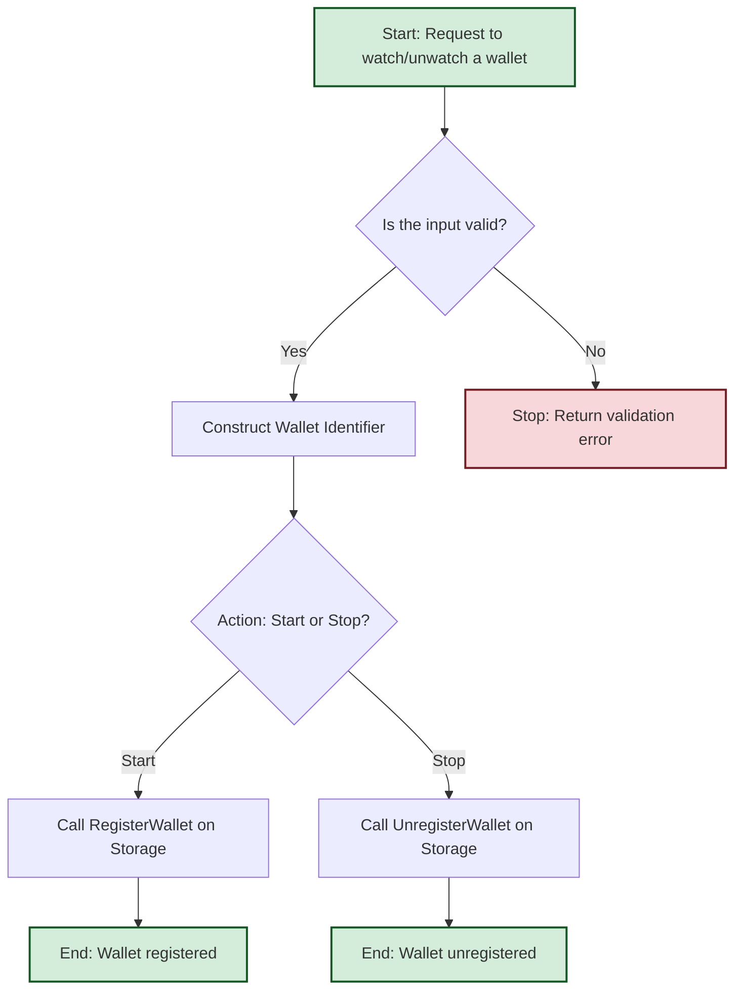

# WalletRegistry Package

The `walletregistry` package provides a service for registering and unregistering wallets for transaction monitoring. It acts as the entry point for managing which wallets are actively tracked by the `blockwatch` system.

## Package Overview

WalletRegistry exposes a simple API to start or stop watching a wallet, identified by its blockchain network and address. It relies on a `WalletStorage` implementation to persist this information, making it available to other services like `walletwatch`.

## Architecture

### Core Components

```
┌─────────────────────────────────────────────────────────────┐
│                  WalletRegistry Service                     │
├─────────────────────────────────────────────────────────────┤
│                      ┌─────────────────┐                    │
│                      │  Wallet Storage │                    │
│                      │   Interface     │                    │
│                      └─────────────────┘                    │
├─────────────────────────────────────────────────────────────┤
│                     Wallet Management                       │
│  ┌─────────────────┐  ┌─────────────────┐  ┌──────────────┐ │
│  │  Start          │  │   Stop          │  │ Wallet       │ │
│  │   Watching      │  │   Watching      │  │ Identifier   │ │
│  └─────────────────┘  └─────────────────┘  └──────────────┘ │
└─────────────────────────────────────────────────────────────┘
```

## Key Interfaces

### Service Interface
```go
type Service interface {
	// StartWatching registers a wallet for transaction monitoring.
	StartWatching(ctx context.Context, network, address string) error

	// StopWatching unregisters a wallet from transaction monitoring.
	StopWatching(ctx context.Context, network, address string) error
}
```

### WalletStorage Interface
The service depends on an implementation of the `WalletStorage` interface to persist the wallet identifiers.

```go
type WalletStorage interface {
	// RegisterWallet adds the given WalletIdentifier to the list of watched wallets.
	RegisterWallet(ctx context.Context, id WalletIdentifier) error

	// UnregisterWallet removes the given WalletIdentifier from the list of watched wallets.
	UnregisterWallet(ctx context.Context, id WalletIdentifier) error
}
```

## Data Types

### WalletIdentifier
Uniquely identifies a wallet to be monitored.

```go
type WalletIdentifier struct {
	Network string `validate:"required"` // Blockchain network (e.g., "ethereum", "solana")
	Address string `validate:"required"` // Wallet address to be watched
}
```

## How It Works

### 1. Initialization
The service is created with an implementation for `WalletStorage`.

```go
service := walletregistry.New(walletStorage)
```

### 2. Registration/Unregistration Workflow

1.  **Receive Request**: The `StartWatching` or `StopWatching` method is called with a network and address.
2.  **Validate Input**: The service validates that the network and address are not empty.
3.  **Construct Identifier**: A `WalletIdentifier` is created from the provided data.
4.  **Persist Change**: The `RegisterWallet` or `UnregisterWallet` method of the `WalletStorage` is called to save the change.

### 3. Workflow Diagram



## Usage

### Basic Usage

```go
// Assume you have an implementation for WalletStorage
var walletStorage WalletStorage

// Create a new service
service := walletregistry.New(walletStorage)

// Register a wallet for watching
ctx := context.Background()
err := service.StartWatching(ctx, "ethereum", "0xSENDER")
if err != nil {
    log.Fatalf("Failed to register wallet: %v", err)
}

// Unregister a wallet
err = service.StopWatching(ctx, "ethereum", "0xSENDER")
if err != nil {
    log.Fatalf("Failed to unregister wallet: %v", err)
}
```

## Integration

The `walletregistry` package provides the mechanism for managing the list of watched wallets. This list is then consumed by other packages, primarily `walletwatch`, which uses a `WalletStorage` implementation to check if a transaction involves a watched wallet.
