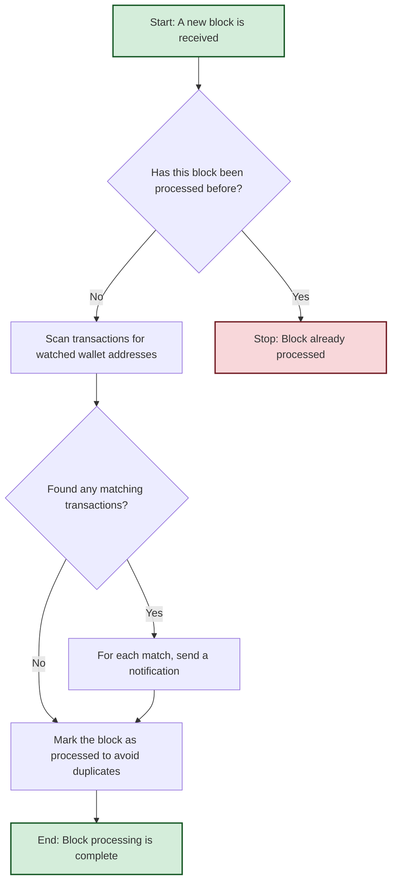

# WalletWatch Package

The `walletwatch` package provides a service for monitoring blockchain blocks, identifying transactions involving specific wallets, and dispatching notifications. It is designed to be a flexible and reliable component for tracking wallet activity within the `blockwatch` project.

## Package Overview

WalletWatch processes blocks from a blockchain, filters transactions to find those involving wallets that are being watched, and sends notifications for these transactions. It is designed to be used in conjunction with a block streaming service (like `chainstream`) and can be configured with custom storage for watched wallets and custom notifiers.

The package includes an optimized transaction filtering algorithm with the `getTransactionsByWallet` function, which has been performance-tested to ensure efficient processing of large transaction volumes at blockchain scale.

## Architecture

### Core Components

```
┌─────────────────────────────────────────────────────────────┐
│                    WalletWatch Service                      │
├─────────────────────────────────────────────────────────────┤
│  ┌─────────────────┐  ┌─────────────────┐  ┌──────────────┐ │
│  │  Wallet Storage │  │  Transaction    │  │ Idempotency  │ │
│  │   Interface     │  │   Notifier      │  │    Guard     │ │
│  └─────────────────┘  └─────────────────┘  └──────────────┘ │
├─────────────────────────────────────────────────────────────┤
│                    Transaction Processing                   │
│  ┌─────────────────┐  ┌─────────────────┐  ┌──────────────┐ │
│  │  Block          │  │   Wallet        │  │ Notification │ │
│  │   Processor     │  │   Filtering     │  │   Dispatch   │ │
│  └─────────────────┘  └─────────────────┘  └──────────────┘ │
└─────────────────────────────────────────────────────────────┘
```

## Key Interfaces

### Service Interface
```go
type Service interface {
    // NotifyWatchedTransactions processes the given block and emits transaction
    // notifications for any watched wallets involved in its transactions.
    NotifyWatchedTransactions(ctx context.Context, block Block) error
}
```

### WalletStorage Interface
The service depends on an implementation of the `WalletStorage` interface to determine which wallets to watch.

```go
type WalletStorage interface {
    // FilterWatchedWallets filters the provided list of wallet addresses and returns
    // only those that are currently under watch for the specified network.
    FilterWatchedWallets(ctx context.Context, network string, addresses []string) ([]string, error)
}
```

### TransactionNotifier Interface
This interface is used to send notifications for relevant transactions.

```go
type TransactionNotifier interface {
    // NotifyTransactions is invoked whenever transactions involving a watched
    // wallet address are detected.
    NotifyTransactions(ctx context.Context, network, wallet string, txs []Transaction) error
}
```

### IdempotencyGuard Interface
Optional interface for preventing duplicate processing of blocks.

```go
type IdempotencyGuard interface {
    // ClaimBlockForTxWatch attempts to claim exclusive rights to process a given block.
    ClaimBlockForTxWatch(ctx context.Context, network, blockHash string, ttl time.Duration) error

    // MarkBlockTxWatchComplete signals that the given block was fully scanned.
    MarkBlockTxWatchComplete(ctx context.Context, network, blockHash string) error
}
```

## Data Types

### Block
The primary input type, representing a blockchain block.

```go
type Block struct {
    Network      string        // Blockchain network (e.g., "ethereum", "polygon")
    Height       types.Hex     // Block height represented as a hex string
    Hash         string        // Unique block hash
    Transactions []Transaction // List of transactions contained in the block
}
```

### Transaction
Represents a blockchain transaction.

```go
type Transaction struct {
    Hash string // Unique transaction hash identifier
    From string // Sender address
    To   string // Recipient address
}
```

## How It Works

### 1. Initialization
The service is created with implementations for `WalletStorage` and `TransactionNotifier`.

```go
service := walletwatch.New(walletStorage, transactionNotifier, options...)
```

### 2. Transaction Processing Workflow

1.  **Receive Block**: The `NotifyWatchedTransactions` method is called with a `Block`.
2.  **Claim Block**: If an `IdempotencyGuard` is configured, it calls `ClaimBlockForTxWatch`.
    - If the block is already processed (`ErrAlreadyFinished`) or being processed (`ErrStillInProgress`), the respective error is returned.
    - If the claim fails for other reasons, the error is propagated.
3.  **Process Transactions**: If the claim is successful, the service uses the optimized `getTransactionsByWallet` function to efficiently filter transactions.
4.  **Filter Wallets**: The function builds an index of all addresses, queries `WalletStorage` to identify watched wallets, and maps transactions to relevant wallets.
5.  **Dispatch Notification**: For each watched wallet with matching transactions, the `TransactionNotifier` is called.
6.  **Mark Complete**: After processing, `MarkBlockTxWatchComplete` is called to prevent future reprocessing. If this fails, an error is logged but not propagated.
7.  **Timeout Control**: The entire process is governed by a `maxProcessingTime`.

### 3. Workflow Diagram



## Performance Optimization

### getTransactionsByWallet Algorithm

The core transaction filtering is handled by the `getTransactionsByWallet` function, which implements an optimized algorithm for identifying transactions involving watched wallets:

1. **Address Indexing**: Builds a unique set of all wallet addresses appearing in transactions
2. **Transaction Mapping**: Creates a reverse index mapping addresses to transaction hashes
3. **Watched Wallet Filtering**: Queries `WalletStorage` to identify which addresses are being watched
4. **Result Construction**: Efficiently maps watched wallets to their associated transactions

This approach minimizes database queries and provides O(1) lookup performance for transaction-to-wallet associations.

### Performance Benchmark Results

A comprehensive benchmark was conducted comparing the current implementation (`getTransactionsByWallet`) against an alternative approach (`getTransactionsByWalletV2`). The benchmark tested performance across various dataset sizes, from small test scenarios to Solana-scale workloads (25k transactions, 100k addresses).

**Key Findings:**
- **Memory Efficiency**: The current implementation makes 41-49% fewer allocations at blockchain scale
- **GC Performance**: Significantly reduced garbage collection pressure due to fewer allocations
- **Scalability**: Better performance characteristics as dataset size increases
- **Production Suitability**: Optimized for sustained performance under continuous load

**Benchmark Results Summary:**

| Dataset Scale | V1 (Current) Allocations | V2 (Alternative) Allocations | V1 Advantage |
|---------------|-------------------------|------------------------------|--------------|
| Small (10 wallets) | 574 allocs/op | 627 allocs/op | 9% fewer |
| Medium (100 wallets) | 1,388 allocs/op | 1,897 allocs/op | 37% fewer |
| Large (1000 wallets) | 4,126 allocs/op | 5,148 allocs/op | 25% fewer |
| Solana Scale | 52,511 allocs/op | 77,533 allocs/op | 48% fewer |

The current implementation was chosen for production use due to its superior memory efficiency and allocation patterns, which are critical for high-throughput blockchain processing environments.

For detailed benchmark results and analysis, see the [performance benchmark report](https://github.com/gabapcia/blockwatch/blob/a52ff4c983ff652d9d404717adbd59a1c9a2e151/internal/walletwatch/report.md).

## Usage

### Basic Usage

```go
// Assume you have implementations for WalletStorage and TransactionNotifier
var walletStorage WalletStorage
var transactionNotifier TransactionNotifier

// Create a new service
service := walletwatch.New(walletStorage, transactionNotifier)

// Create a block to process
block := walletwatch.Block{
    Network: "ethereum",
    Height:  "0x1",
    Hash:    "0xabc",
    Transactions: []walletwatch.Transaction{
        {Hash: "0x123", From: "0xSENDER", To: "0xRECIPIENT"},
    },
}

// Process the block
ctx := context.Background()
err := service.NotifyWatchedTransactions(ctx, block)
if err != nil {
    log.Fatalf("Failed to process block: %v", err)
}
```

## Configuration Options

### WithMaxProcessingTime
Overrides the default 5-minute processing timeout for a block.

```go
service := walletwatch.New(ws, tn,
    walletwatch.WithMaxProcessingTime(10*time.Minute),
)
```

### WithIdempotencyGuard
Provides an idempotency guard to prevent reprocessing the same block.

```go
var idempotencyGuard IdempotencyGuard
service := walletwatch.New(ws, tn,
    walletwatch.WithIdempotencyGuard(idempotencyGuard),
)
```

## Error Handling

The service defines specific error types for idempotency control:

- `ErrStillInProgress`: Returned when a block is currently being processed by another instance
- `ErrAlreadyFinished`: Returned when a block has already been processed successfully

These errors allow upstream logic to implement appropriate retry or skip behavior.

## Integration

The `walletwatch` package is designed to be a consumer of block data. In the context of the `blockwatch` project, it would typically be used with the `chainstream` package. The `chainstream` service would provide the stream of `ObservedBlock`s, which would then be passed to the `walletwatch` service for processing.

Example of integration with `chainstream`:

```go
// Setup chainstream
chainStreamService := chainstream.New(networks)
blocksCh, _ := chainStreamService.Start(ctx)

// Setup walletwatch
walletWatchService := walletwatch.New(walletStorage, transactionNotifier)

// Process blocks from chainstream
for observedBlock := range blocksCh {
    block := walletwatch.Block{
        Network:      observedBlock.Network,
        Height:       observedBlock.Height,
        Hash:         observedBlock.Hash,
        Transactions: observedBlock.Transactions, // Assuming structure matches
    }
    
    err := walletWatchService.NotifyWatchedTransactions(ctx, block)
    if err != nil {
        log.Printf("Error processing block %s: %v", block.Height, err)
    }
}
